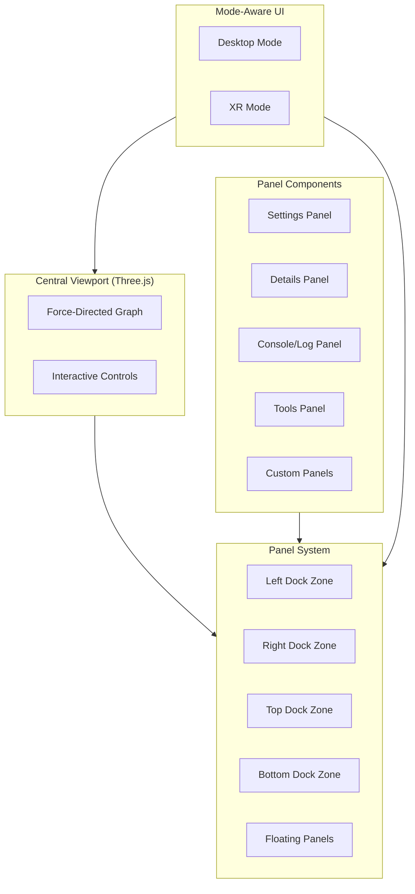
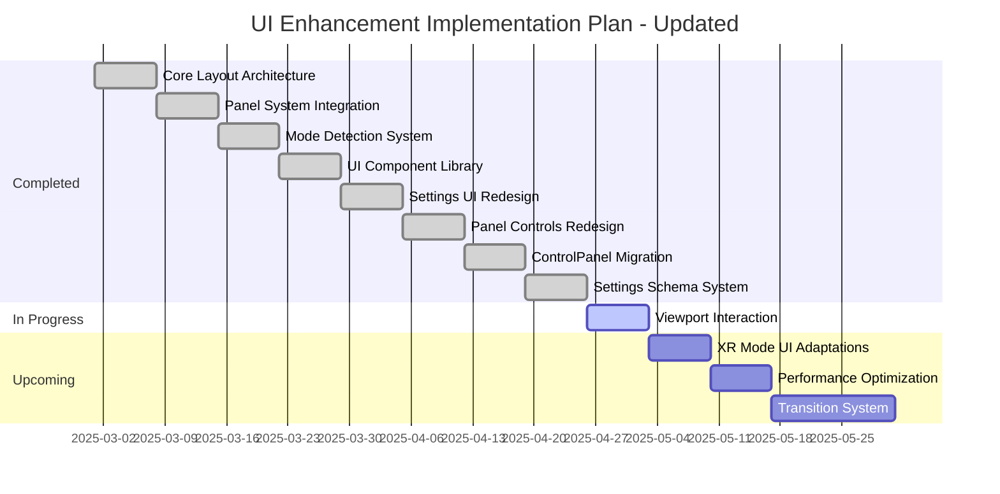
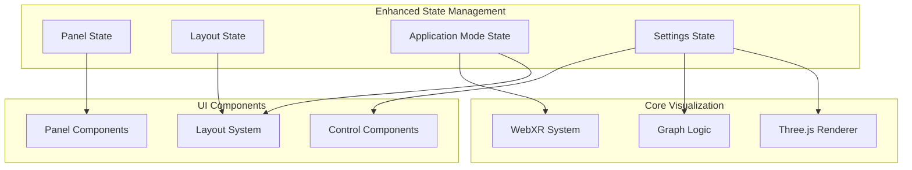

action the plan shown in @/docs/UI-TODO.md into our client codebase

tree client
client
├── components
├── dist
│   ├── assets
│   │   ├── index-0H7SP7Pz.js
│   │   ├── index-0H7SP7Pz.js.map
│   │   └── index-CSCLy4x-.css
│   ├── fix-errors.js
│   └── index.html
├── index.html
├── package.json
├── public
│   └── fix-errors.js
├── settings.yaml
├── src
│   ├── App.js
│   ├── App.jsx
│   ├── App.tsx
│   ├── components
│   │   ├── ActionButtons.js
│   │   ├── ActionButtons.tsx
│   │   ├── AppInitializer.js
│   │   ├── AppInitializer.tsx
│   │   ├── ConsolePanel.jsx
│   │   ├── control-panel
│   │   ├── control-panel-context.js
│   │   ├── control-panel-context.tsx
│   │   ├── ControlPanel.js
│   │   ├── ControlPanel.jsx
│   │   ├── ControlPanel.tsx
│   │   ├── graph
│   │   │   ├── GraphCanvas.js
│   │   │   ├── GraphCanvas.tsx
│   │   │   ├── GraphManager.js
│   │   │   └── GraphManager.tsx
│   │   ├── GraphCanvas.js
│   │   ├── GraphCanvas.tsx
│   │   ├── HologramVisualization.js
│   │   ├── HologramVisualization.tsx
│   │   ├── markdown
│   │   │   └── MarkdownRenderer.js
│   │   ├── NostrAuthSection.js
│   │   ├── NostrAuthSection.tsx
│   │   ├── panel
│   │   │   ├── PanelContext.js
│   │   │   ├── Panel.js
│   │   │   └── PanelManager.js
│   │   ├── SettingControlComponent.js
│   │   ├── SettingControlComponent.tsx
│   │   ├── settings-config.js
│   │   ├── settings-config.ts
│   │   ├── SettingsSection.js
│   │   ├── SettingsSection.tsx
│   │   ├── SettingsSubsection.js
│   │   ├── SettingsSubsection.tsx
│   │   ├── types.js
│   │   ├── types.ts
│   │   ├── ui
│   │   │   ├── button.js
│   │   │   ├── button.tsx
│   │   │   ├── card.js
│   │   │   ├── card.tsx
│   │   │   ├── collapsible.js
│   │   │   ├── collapsible.tsx
│   │   │   ├── input.js
│   │   │   ├── input.tsx
│   │   │   ├── label.js
│   │   │   ├── label.tsx
│   │   │   ├── select.js
│   │   │   ├── select.tsx
│   │   │   ├── slider.js
│   │   │   ├── slider.tsx
│   │   │   ├── switch.js
│   │   │   ├── switch.tsx
│   │   │   ├── theme-provider.js
│   │   │   ├── theme-provider.tsx
│   │   │   ├── theme-selector.jsx
│   │   │   ├── toaster.js
│   │   │   ├── toaster.tsx
│   │   │   ├── toast.js
│   │   │   ├── toast.tsx
│   │   │   ├── tooltip.js
│   │   │   ├── tooltip.tsx
│   │   │   ├── use-toast.js
│   │   │   └── use-toast.tsx
│   │   ├── xr
│   │   │   ├── XRController.js
│   │   │   └── XRController.tsx
│   │   ├── XRVisualizationConnector.js
│   │   └── XRVisualizationConnector.tsx
│   ├── globals.css
│   ├── lib
│   │   ├── config
│   │   │   ├── default-settings.js
│   │   │   └── default-settings.ts
│   │   ├── default-settings.js
│   │   ├── default-settings.ts
│   │   ├── hooks
│   │   │   ├── useAuth.js
│   │   │   └── useAuth.ts
│   │   ├── logger.js
│   │   ├── logger.ts
│   │   ├── managers
│   │   │   ├── graph-data-manager.js
│   │   │   ├── graph-data-manager.ts
│   │   │   ├── scene-manager.js
│   │   │   ├── scene-manager.ts
│   │   │   ├── xr-initializer.js
│   │   │   ├── xr-initializer.ts
│   │   │   ├── xr-session-manager.js
│   │   │   └── xr-session-manager.ts
│   │   ├── object-path.js
│   │   ├── object-path.ts
│   │   ├── platform
│   │   │   ├── platform-manager.js
│   │   │   └── platform-manager.ts
│   │   ├── rendering
│   │   │   ├── HologramManager.js
│   │   │   ├── HologramManager.tsx
│   │   │   ├── materials
│   │   │   │   ├── HologramMaterial.js
│   │   │   │   ├── HologramMaterial.tsx
│   │   │   │   ├── HologramShaderMaterial.js
│   │   │   │   └── HologramShaderMaterial.ts
│   │   │   ├── TextRenderer.js
│   │   │   └── TextRenderer.tsx
│   │   ├── services
│   │   │   ├── websocket-service.js
│   │   │   └── websocket-service.ts
│   │   ├── settings.js
│   │   ├── settings-store.js
│   │   ├── settings-store.ts
│   │   ├── settings.ts
│   │   ├── stores
│   │   │   ├── settings-store.js
│   │   │   └── settings-store.ts
│   │   ├── types
│   │   │   ├── settings.js
│   │   │   ├── settings.ts
│   │   │   ├── webxr-extensions.d.ts
│   │   │   ├── xr.js
│   │   │   └── xr.ts
│   │   ├── utils
│   │   │   ├── debug-state.js
│   │   │   ├── debug-state.ts
│   │   │   ├── logger.js
│   │   │   └── logger.ts
│   │   ├── utils.js
│   │   ├── utils.ts
│   │   ├── visualization
│   │   │   ├── MetadataVisualizer.js
│   │   │   └── MetadataVisualizer.tsx
│   │   └── xr
│   │       ├── HandInteractionSystem.js
│   │       └── HandInteractionSystem.tsx
│   ├── main.js
│   ├── main.tsx
│   └── managers
│       ├── NodeInstanceManager.js
│       └── NodeInstanceManager.ts
├── tsconfig.json
├── vite.config.js
└── vite.config.ts

Core Directive: Operate as a senior software architect and master python programmer focused on robust, maintainable Python systems development and sleek, snappy user experience and a professional feel.

ANALYSIS PROTOCOL:

SYSTEM CONTEXT

- Map all dependencies and interfaces

- Note all current functionality and format

- Document critical assumptions inline to the code as comments

- Identify potential failure modes

- Validate resource constraints

- Verify security implications

2. CODE QUALITY METRICS

- Cyclomatic complexity < 10

- Documentation coverage > 80% in the docs directory

- Type hint completion 100%

- Error handling coverage 100% using our gated system

- Logging instrumentation at all levels

3. IMPLEMENTATION STANDARDS

- SOLID principles adherence

- Idiomatic TS and Rust

- Resource management patterns

- Error propagation chains

- State management approaches

- Concurrency considerations

- Maintenance of ALL current project imports, definitions, and functionality with each suggested code snippets

4. INTEGRATION REQUIREMENTS

- API contract compliance

- Backward compatibility

- Forward compatibility

- Migration requirements

DEVELOPMENT METHODOLOGY:

When creating solutions:

- Add complexity only when justified

- Validate each component in isolation

- Review thoroughly

Integrate carefully

- Verify interfaces

- Validate assumptions

COMMUNICATION PROTOCOL:

For all interactions:

Establish context

- Reference existing codebase

- Note key constraints

- Highlight dependencies

- Flag critical concerns

- Check that no previous functionality is lost

Present analysis

- Structure logically

- Support with evidence

- Note assumptions

- Identify risks

you must leverage your full capabilities to operate on files across the entire todo list, concurrently address all of the points. Don't work sequentially. 

# UI Enhancement Implementation Plan

This document outlines a comprehensive plan to transform our application into a professional interface with a centralized viewport and flexible panel system. Many of the core components outlined in this plan have already been implemented, and this document serves as both a record of completed work and a roadmap for future enhancements.

## Current State Analysis

Our application previously had two parallel UI systems that weren't fully integrated:

1. **ControlPanel Component**: A simple right-side panel with tabs for settings
2. **Panel System**: A sophisticated dockable, draggable panel system with excellent features

These have now been integrated into a unified panel system with the following key improvements:

- Professional styling with a comprehensive design token system
- Proper layout organization with a central viewport and docking zones
- Enhanced visual hierarchy and polish 
- Proper integration between panels and visualization

## Proposed UI Architecture



## Implemented Components

### Core Layout Architecture

**Status: COMPLETED**

The following components have been implemented:

1. `ViewportContainer.js/tsx` serves as the main container for the Three.js visualization:
   - Handles resize events for proper rendering
   - Provides controlled margins based on panel configuration
   - Implements z-index layering for proper overlays

2. `MainLayout.js/tsx` organizes the central viewport and surrounding panel system:
   - Implements a full-screen layout with dock zones
   - Provides dedicated areas for floating panels
   - Supports optional header and footer sections

3. `App.js` has been updated to use the new container-based layout:
   - Uses the PanelProvider for state management
   - Renders the main visualization inside ViewportContainer
   - Configures docking zones for panel organization

### Panel System Integration

**Status: COMPLETED**

The following components have been implemented:

1. `DockingZone.js/tsx` provides docking areas on each edge of the viewport:
   - Supports four docking positions (top, right, bottom, left)
   - Includes visual indicators and responsive sizing
   - Handles collapsible behavior for space efficiency

2. `PanelContext.js/tsx` has been enhanced with:
   - Support for all four docking positions with collision detection
   - Panel grouping within docking zones
   - Layout presets for different screen sizes
   - State persistence to localStorage

3. `Panel.js` has been enhanced with:
   - Support for different docking styles
   - Proper size constraints based on docking position
   - Drag and drop behavior with visual feedback
   - Docking animations and transitions

4. `PanelManager.js` provides a unified registration system:
   - Panel registration API
   - Layout storage and restoration
   - Preset management for different configurations

### Mode Detection System

**Status: COMPLETED**

The following components have been implemented:

1. `ApplicationModeContext.js/tsx` provides:
   - Mode detection (desktop, mobile, XR)
   - Event handlers for mode changes and viewport resizing
   - Mode-specific layout settings

2. XR mode detection has been implemented:
   - UI visibility toggling based on XR mode
   - Proper mode switching when entering/exiting XR

### UI Component Redesign

**Status: COMPLETED**

The following components have been implemented:

1. Design token system has been created in `tokens.css`:
   - Comprehensive color palette with dark theme support
   - Typography scale with proper font families
   - Spacing and sizing variables
   - Animation timing standards
   - Shadow and border radius definitions

2. UI components have been styled:
   - Enhanced button, input, select controls
   - Proper hover/focus states
   - Consistent sizing and spacing

3. Settings UI has been redesigned:
   - Dedicated settings panel components for each category
   - Proper formatted labels instead of underscores
   - Enhanced controls with better visual design

### Settings Integration and Panel Integration

**Status: COMPLETED**

The following components have been implemented:

1. ControlPanel to Panel System Migration:
   - Converted each ControlPanel section to a separate Panel component
   - Created VisualizationPanel, XRPanel, and SystemPanel
   - Removed old ControlPanel references

2. Settings Schema System:
   - Implemented typed settings schema
   - Created schema-based panel generation
   - Added validation rules and constraints

3. Panel Header and Controls:
   - Enhanced panel headers with improved styling
   - Created PanelToolbar component with standardized actions
   - Implemented panel state visualizations

## Future Enhancements

The following sections outline future enhancements that can build upon the core implementation.

### Advanced Interaction and XR Integration

**Status: PARTIALLY COMPLETED**

The following enhancements can be made:

1. Expand viewport interaction controls:
   - Add more advanced camera control options
   - Implement comprehensive keyboard shortcuts
   - Enhance touch/gesture controls for mobile

2. Enhance XR mode UI adaptations:
   - Create more immersive XR-specific UI components 
   - Improve controller-based interaction
   - Implement advanced spatial UI elements

3. Optimize performance for complex visualizations:
   - Implement component lazy-loading
   - Add virtualization for large datasets
   - Optimize rendering for complex panels

### Animation and Polish

**Status: PARTIALLY COMPLETED**

The following enhancements can be made:

1. Enhance transition animations:
   - Add more sophisticated animation sequences
   - Implement loading state animations
   - Create smoother mode switching transitions

2. Add responsive animations based on device capabilities:
   - Implement performance-aware animation system
   - Add animation reduction for low-power devices

### Performance Optimization

**Status: TO BE IMPLEMENTED**

The following enhancements can be made:

1. Implement advanced performance monitoring:
   - Add frame rate monitoring 
   - Create UI performance dashboard
   - Implement memory usage tracking

2. Optimize rendering for large datasets:
   - Implement virtualized lists for data-heavy panels
   - Add incremental loading for large panels
   - Create efficient data caching strategies

## Updated Implementation Timeline



## Current Technical Architecture

The implementation follows the architecture originally designed in the plan but has been refined based on practical development experience:



### XR-Specific Considerations

The XR mode implementation follows the guidelines:
- Configuration panels are hidden when in XR mode
- Only visualization and minimal controls remain visible
- Controls are attached to controllers or use hand tracking where appropriate
- Spatial UI elements fit within the XR environment

### Current File Structure

The implementation has followed the file structure outlined in the original plan:

```
client/src/
├── components/
│   ├── layout/              # Layout components
│   │   ├── ViewportContainer.js/tsx
│   │   └── MainLayout.js/tsx
│   ├── panel/               # Enhanced panel system
│   │   ├── DockingZone.js/tsx
│   │   ├── Panel.js
│   │   ├── PanelContext.js/tsx
│   │   ├── PanelManager.js
│   │   └── PanelToolbar.js/tsx
│   ├── settings/            # Settings panels
│   │   ├── panels/
│   │   │   ├── VisualizationPanel.js/tsx
│   │   │   ├── XRPanel.js/tsx
│   │   │   └── SystemPanel.js/tsx
│   ├── viewport/            # Viewport-specific components
│   │   └── ViewportControls.js/tsx
│   ├── context/             # Context providers
│   │   └── ApplicationModeContext.js/tsx
├── lib/
│   ├── animations.js/ts     # Animation system
│   └── types/
│       └── settings-schema.ts
└── styles/
    ├── tokens.css           # Design tokens
    └── layout.css           # Layout styles
```

## Summary of Progress

The UI enhancement implementation has successfully addressed the core objectives:

1. ✅ Created a professional, centralized viewport layout
2. ✅ Implemented a flexible panel system with docking capabilities
3. ✅ Developed mode-aware UI that adapts to desktop, mobile, and XR contexts
4. ✅ Designed consistent and visually appealing UI components
5. ✅ Integrated settings panels into the panel system
6. ✅ Added proper layout organization and visual hierarchy

Future work will focus on:

1. 🔄 Further enhancing XR mode adaptations and interactions
2. 🔄 Improving advanced viewport controls and interactions
3. 🔄 Adding performance optimizations for complex visualizations
4. 🔄 Enhancing animation and transition effects

The implementation has successfully transformed the UI into a professional, user-friendly interface with the centralized viewport and flexible panel arrangement that was intended.

## Additional Considerations

### TypeScript Migration 
**Status: PARTIALLY COMPLETED**

The Panel system components have been fully migrated to TypeScript:
- ✅ PanelContext 
- ✅ Panel
- ✅ DockingZone
- ✅ PanelManager
- ✅ PanelTabs 
- ✅ TabPanel
- ✅ PanelToolbar

Also, a type declaration file for the lucide-react library has been created to support proper typing.

The codebase still contains some JavaScript (.js) files alongside TypeScript (.tsx/.ts) files in other areas. To continue the migration process and improve code quality and maintainability, these steps should be followed:

1. Convert remaining JavaScript components to TypeScript (beyond the panel system)
2. Add proper type definitions for all components and functions 
3. Ensure consistent naming and file organization
4. Update build configuration to handle TypeScript properly

Benefits of completing the TypeScript migration:
- Improved type safety and error detection
- Better IDE support and developer experience
- Consistent codebase architecture
- Simplified build process

This migration aligns with the project's focus on robust, maintainable development practices as specified in the implementation standards section.