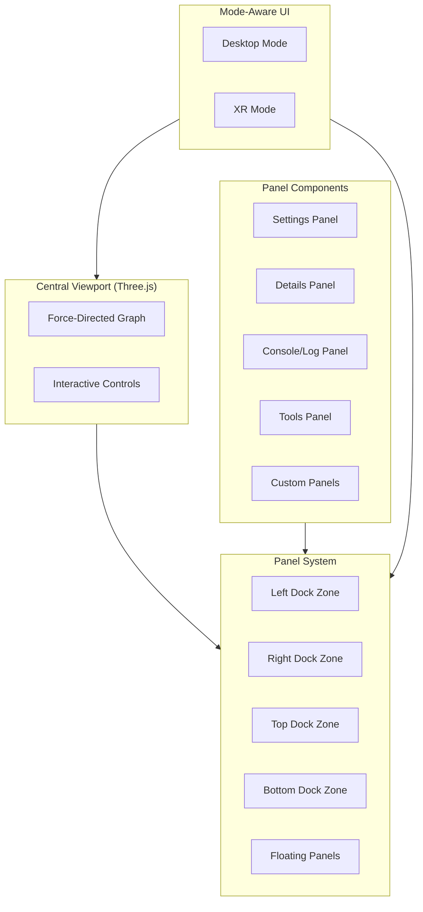
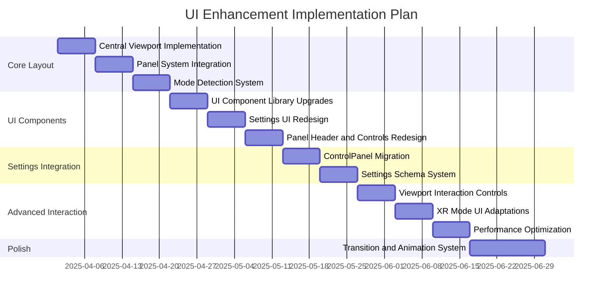
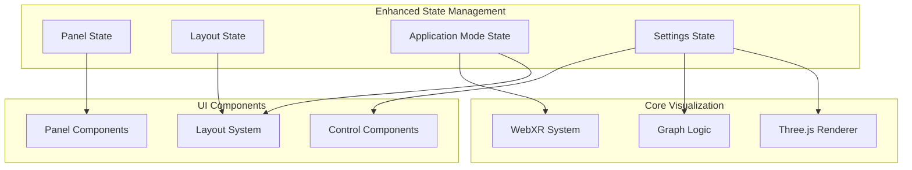

action the plan shown in @/docs/UI-TODO.md into our client codebase

tree client
client
├── components
├── dist
│   ├── assets
│   │   ├── index-0H7SP7Pz.js
│   │   ├── index-0H7SP7Pz.js.map
│   │   └── index-CSCLy4x-.css
│   ├── fix-errors.js
│   └── index.html
├── index.html
├── package.json
├── public
│   └── fix-errors.js
├── settings.yaml
├── src
│   ├── App.js
│   ├── App.jsx
│   ├── App.tsx
│   ├── components
│   │   ├── ActionButtons.js
│   │   ├── ActionButtons.tsx
│   │   ├── AppInitializer.js
│   │   ├── AppInitializer.tsx
│   │   ├── ConsolePanel.jsx
│   │   ├── control-panel
│   │   ├── control-panel-context.js
│   │   ├── control-panel-context.tsx
│   │   ├── ControlPanel.js
│   │   ├── ControlPanel.jsx
│   │   ├── ControlPanel.tsx
│   │   ├── graph
│   │   │   ├── GraphCanvas.js
│   │   │   ├── GraphCanvas.tsx
│   │   │   ├── GraphManager.js
│   │   │   └── GraphManager.tsx
│   │   ├── GraphCanvas.js
│   │   ├── GraphCanvas.tsx
│   │   ├── HologramVisualization.js
│   │   ├── HologramVisualization.tsx
│   │   ├── markdown
│   │   │   └── MarkdownRenderer.js
│   │   ├── NostrAuthSection.js
│   │   ├── NostrAuthSection.tsx
│   │   ├── panel
│   │   │   ├── PanelContext.js
│   │   │   ├── Panel.js
│   │   │   └── PanelManager.js
│   │   ├── SettingControlComponent.js
│   │   ├── SettingControlComponent.tsx
│   │   ├── settings-config.js
│   │   ├── settings-config.ts
│   │   ├── SettingsSection.js
│   │   ├── SettingsSection.tsx
│   │   ├── SettingsSubsection.js
│   │   ├── SettingsSubsection.tsx
│   │   ├── types.js
│   │   ├── types.ts
│   │   ├── ui
│   │   │   ├── button.js
│   │   │   ├── button.tsx
│   │   │   ├── card.js
│   │   │   ├── card.tsx
│   │   │   ├── collapsible.js
│   │   │   ├── collapsible.tsx
│   │   │   ├── input.js
│   │   │   ├── input.tsx
│   │   │   ├── label.js
│   │   │   ├── label.tsx
│   │   │   ├── select.js
│   │   │   ├── select.tsx
│   │   │   ├── slider.js
│   │   │   ├── slider.tsx
│   │   │   ├── switch.js
│   │   │   ├── switch.tsx
│   │   │   ├── theme-provider.js
│   │   │   ├── theme-provider.tsx
│   │   │   ├── theme-selector.jsx
│   │   │   ├── toaster.js
│   │   │   ├── toaster.tsx
│   │   │   ├── toast.js
│   │   │   ├── toast.tsx
│   │   │   ├── tooltip.js
│   │   │   ├── tooltip.tsx
│   │   │   ├── use-toast.js
│   │   │   └── use-toast.tsx
│   │   ├── xr
│   │   │   ├── XRController.js
│   │   │   └── XRController.tsx
│   │   ├── XRVisualizationConnector.js
│   │   └── XRVisualizationConnector.tsx
│   ├── globals.css
│   ├── lib
│   │   ├── config
│   │   │   ├── default-settings.js
│   │   │   └── default-settings.ts
│   │   ├── default-settings.js
│   │   ├── default-settings.ts
│   │   ├── hooks
│   │   │   ├── useAuth.js
│   │   │   └── useAuth.ts
│   │   ├── logger.js
│   │   ├── logger.ts
│   │   ├── managers
│   │   │   ├── graph-data-manager.js
│   │   │   ├── graph-data-manager.ts
│   │   │   ├── scene-manager.js
│   │   │   ├── scene-manager.ts
│   │   │   ├── xr-initializer.js
│   │   │   ├── xr-initializer.ts
│   │   │   ├── xr-session-manager.js
│   │   │   └── xr-session-manager.ts
│   │   ├── object-path.js
│   │   ├── object-path.ts
│   │   ├── platform
│   │   │   ├── platform-manager.js
│   │   │   └── platform-manager.ts
│   │   ├── rendering
│   │   │   ├── HologramManager.js
│   │   │   ├── HologramManager.tsx
│   │   │   ├── materials
│   │   │   │   ├── HologramMaterial.js
│   │   │   │   ├── HologramMaterial.tsx
│   │   │   │   ├── HologramShaderMaterial.js
│   │   │   │   └── HologramShaderMaterial.ts
│   │   │   ├── TextRenderer.js
│   │   │   └── TextRenderer.tsx
│   │   ├── services
│   │   │   ├── websocket-service.js
│   │   │   └── websocket-service.ts
│   │   ├── settings.js
│   │   ├── settings-store.js
│   │   ├── settings-store.ts
│   │   ├── settings.ts
│   │   ├── stores
│   │   │   ├── settings-store.js
│   │   │   └── settings-store.ts
│   │   ├── types
│   │   │   ├── settings.js
│   │   │   ├── settings.ts
│   │   │   ├── webxr-extensions.d.ts
│   │   │   ├── xr.js
│   │   │   └── xr.ts
│   │   ├── utils
│   │   │   ├── debug-state.js
│   │   │   ├── debug-state.ts
│   │   │   ├── logger.js
│   │   │   └── logger.ts
│   │   ├── utils.js
│   │   ├── utils.ts
│   │   ├── visualization
│   │   │   ├── MetadataVisualizer.js
│   │   │   └── MetadataVisualizer.tsx
│   │   └── xr
│   │       ├── HandInteractionSystem.js
│   │       └── HandInteractionSystem.tsx
│   ├── main.js
│   ├── main.tsx
│   └── managers
│       ├── NodeInstanceManager.js
│       └── NodeInstanceManager.ts
├── tsconfig.json
├── vite.config.js
└── vite.config.ts

Core Directive: Operate as a senior software architect and master python programmer focused on robust, maintainable Python systems development and sleek, snappy user experience and a professional feel.

ANALYSIS PROTOCOL:

SYSTEM CONTEXT

- Map all dependencies and interfaces

- Note all current functionality and format

- Document critical assumptions inline to the code as comments

- Identify potential failure modes

- Validate resource constraints

- Verify security implications

2. CODE QUALITY METRICS

- Cyclomatic complexity < 10

- Documentation coverage > 80% in the docs directory

- Type hint completion 100%

- Error handling coverage 100% using our gated system

- Logging instrumentation at all levels

3. IMPLEMENTATION STANDARDS

- SOLID principles adherence

- Idiomatic TS and Rust

- Resource management patterns

- Error propagation chains

- State management approaches

- Concurrency considerations

- Maintenance of ALL current project imports, definitions, and functionality with each suggested code snippets

4. INTEGRATION REQUIREMENTS

- API contract compliance

- Backward compatibility

- Forward compatibility

- Migration requirements

DEVELOPMENT METHODOLOGY:

When creating solutions:

- Add complexity only when justified

- Validate each component in isolation

- Review thoroughly

Integrate carefully

- Verify interfaces

- Validate assumptions

COMMUNICATION PROTOCOL:

For all interactions:

Establish context

- Reference existing codebase

- Note key constraints

- Highlight dependencies

- Flag critical concerns

- Check that no previous functionality is lost

Present analysis

- Structure logically

- Support with evidence

- Note assumptions

- Identify risks

you must leverage your full capabilities to operate on files across the entire todo list, concurrently address all of the points. Don't work sequentially. 

# UI Enhancement Implementation Plan

This document outlines a comprehensive plan to transform our application into a professional interface with a centralized viewport and flexible panel system. This plan focuses on specific technical implementations needed to achieve the desired UI, leveraging our existing codebase.

## Current State Analysis

Our application has two parallel UI systems that aren't fully integrated:

1. **ControlPanel Component**: A simple right-side panel with tabs for settings
2. **Panel System**: A sophisticated dockable, draggable panel system with excellent features

Our interface currently lacks:
- Professional styling (underscores in labels, basic inputs)
- Proper layout organization
- Visual hierarchy and polish
- Integration between panels and visualization

## Proposed UI Architecture



## Phase 1: Core Layout Architecture (2-3 weeks)

### 1.1 Central Viewport Implementation (Week 1)

**Tasks:**
1. Create a `ViewportContainer.tsx` component to serve as the main container:
   ```
   client/src/components/layout/ViewportContainer.tsx
   ```

2. Modify `App.tsx` to use the new container-based layout:
   - Replace the current direct rendering of GraphCanvas
   - Implement z-index layering for proper panel overlays
   - Create viewport size management with controlled margins based on panel configuration

3. Implement resize handling for the viewport when panels are docked/undocked:
   - Add resize handlers in ViewportContainer
   - Create a resize notification system for Three.js renderer

4. Standardize container styling in a dedicated stylesheet:
   ```
   client/src/styles/layout.css
   ```

### 1.2 Panel System Integration (Week 2)

**Tasks:**
1. Create a `DockingZone.tsx` component for each edge of the viewport:
   ```
   client/src/components/panel/DockingZone.tsx
   ```

2. Modify `PanelContext.js` to support the four docking positions (top, right, bottom, left):
   - Add docking position state management
   - Implement collision detection for panels
   - Add panel grouping within docking zones

3. Enhance the `Panel.js` component to support different docking styles:
   - Add proper size constraints based on docking position
   - Implement docking animation and transitions
   - Add visual indication of docking zones when dragging

4. Create a unified panel registration system in `PanelManager.js`:
   - Implement panel registration API
   - Add mechanism to store/restore panel layouts
   - Create layout presets for different screen sizes

### 1.3 Mode Detection System (Week 3)

**Tasks:**
1. Implement an `ApplicationModeContext.tsx`:
   ```
   client/src/components/context/ApplicationModeContext.tsx
   ```
   - Add mode detection (desktop, mobile, XR)
   - Add event handlers for mode changes
   - Implement mode-specific layout settings

2. Create XR mode detection in the `XRController.tsx`:
   - Add session detection with proper callbacks
   - Implement UI visibility toggling based on XR mode
   - Create XR session lifecycle handlers

3. Enhance `PanelManager.js` with mode-aware behavior:
   - Add mode-specific panel visibility
   - Implement layout transitions between modes
   - Add panel visibility rules based on mode

## Phase 2: UI Component Redesign (2-3 weeks)

### 2.1 UI Component Library Upgrades (Week 1)

**Tasks:**
1. Create a design token system for consistent styling:
   ```
   client/src/styles/tokens.css
   ```
   - Define color palette with proper contrast ratios
   - Create typography scale
   - Define spacing and sizing system
   - Implement animation timing standards

2. Enhance existing UI components with polished styling:
   - Update `button.tsx`, `input.tsx`, `select.tsx`, etc.
   - Add hover/focus states with proper visual feedback
   - Implement consistent sizing and spacing

3. Create compound components for common UI patterns:
   ```
   client/src/components/ui/form-group/
   client/src/components/ui/expandable-section/
   client/src/components/ui/tab-group/
   ```

### 2.2 Settings UI Redesign (Week 2)

**Tasks:**
1. Create dedicated settings panel components for each category:
   ```
   client/src/components/settings/VisualizationSettings.tsx
   client/src/components/settings/XRSettings.tsx
   client/src/components/settings/SystemSettings.tsx
   ```

2. Replace underscore labels with proper formatted labels:
   - Implement a label formatter utility
   - Apply consistent capitalization rules
   - Create proper grouping of related settings

3. Enhance settings controls with better visual design:
   - Add proper input validation with visual feedback
   - Create intuitive color pickers
   - Implement toggles with visual state indicators
   - Add help tooltips for complex settings

### 2.3 Panel Header and Controls Redesign (Week 3)

**Tasks:**
1. Enhance panel headers with improved controls:
   - Redesign header with more intuitive icons
   - Add visual cues for docked vs. floating state
   - Implement consistent panel title styling

2. Create a panel toolbar component:
   ```
   client/src/components/panel/PanelToolbar.tsx
   ```
   - Add standardized action buttons
   - Implement collapsible sections
   - Create context-specific controls

3. Implement panel state visualizations:
   - Add visual indicators for active/inactive panels
   - Create loading states for panel content
   - Implement error states with proper feedback

## Phase 3: Settings Integration and Refactoring (2 weeks)

### 3.1 ControlPanel to Panel System Migration (Week 1)

**Tasks:**
1. Convert each ControlPanel section to a separate Panel component:
   ```
   client/src/components/settings/panels/VisualizationPanel.tsx
   client/src/components/settings/panels/XRPanel.tsx
   client/src/components/settings/panels/SystemPanel.tsx
   ```

2. Update `SettingsSection.tsx` to work within the Panel component:
   - Adapt to new styling system
   - Implement scrollable content area
   - Add section collapse/expand functionality

3. Remove the old ControlPanel component and update references:
   - Refactor App.tsx to use new panel system
   - Update imports and dependencies
   - Clean up unused code

### 3.2 Settings Schema System (Week 2)

**Tasks:**
1. Create a typed settings schema system:
   ```
   client/src/lib/types/settings-schema.ts
   ```
   - Define TypeScript interfaces for all settings
   - Add validation rules and constraints
   - Create default value specifications

2. Implement schema-based settings panel generation:
   - Create dynamic form generation from schema
   - Add validation based on schema rules
   - Implement type-safe settings access

3. Create a settings documentation generator:
   - Add descriptive metadata to schemas
   - Generate help documentation from schemas
   - Create searchable settings index

## Phase 4: Advanced Interaction and XR Integration (2-3 weeks)

### 4.1 Viewport Interaction Controls (Week 1)

**Tasks:**
1. Create a viewport controls overlay:
   ```
   client/src/components/viewport/ViewportControls.tsx
   ```
   - Add camera control buttons
   - Implement view presets
   - Create navigation aids
   - Add interaction mode selectors

2. Implement keyboard shortcuts for viewport navigation:
   - Add keyboard handling for camera movement
   - Create shortcut system for common actions
   - Add shortcut overlays for user assistance

3. Add touch/gesture controls for mobile:
   - Implement pinch-to-zoom
   - Add multi-touch rotation
   - Create touch-friendly controls

### 4.2 XR Mode UI Adaptations (Week 2)

**Tasks:**
1. Create XR-specific UI components:
   ```
   client/src/components/xr/ui/XRControlPanel.tsx
   client/src/components/xr/ui/XRToolbar.tsx
   ```
   - Design 3D interfaces for XR
   - Implement controller-based interaction
   - Create hand tracking UI elements

2. Implement conditional UI rendering based on XR mode:
   - Hide desktop panels in XR mode
   - Show XR-specific controls in XR mode
   - Add transition animations between modes

3. Create spatial UI that works within the XR environment:
   - Design UI elements that exist in 3D space
   - Create controller-attached panels
   - Implement gaze-based interaction

### 4.3 Performance Optimization for UI (Week 3)

**Tasks:**
1. Implement component lazy-loading:
   - Add code splitting for panel components
   - Implement dynamic imports for settings panels
   - Create fallback loading states

2. Add performance monitoring for UI components:
   - Create render timing measurements
   - Add interaction timing metrics
   - Implement UI performance dashboard

3. Optimize rendering for complex panels:
   - Implement virtualized lists for large datasets
   - Add memoization for expensive calculations
   - Create incremental loading for large panels

## Phase 5: Polish and Transitions (2 weeks)

### 5.1 Transition and Animation System (Week 1-2)

**Tasks:**
1. Create a consistent animation system:
   ```
   client/src/lib/animations.ts
   ```
   - Define animation timing curves
   - Implement transition functions
   - Create animation presets

2. Apply animations throughout the UI:
   - Add panel open/close animations
   - Implement dock/undock transitions
   - Create smooth mode switching animations
   - Add loading state animations

3. Implement responsive animations based on device capabilities:
   - Add animation reduction for low-power devices
   - Create performance-aware animation system
   - Implement frame-rate monitoring

## Implementation Timeline



## Technical Architecture

### State Management Architecture



### XR-Specific Considerations

When running in XR mode on Meta Quest 3:
- All configuration panels should be hidden
- Only visualization and minimal controls should remain
- Any necessary controls should be attached to controllers or use hand tracking
- Consider spatial UI elements that fit within the XR environment

### File Structure

The implementation will follow this file structure, building on the existing codebase:

```
client/src/
├── components/
│   ├── layout/              # Layout components
│   │   ├── ViewportContainer.tsx
│   │   └── MainLayout.tsx
│   ├── panel/               # Enhanced panel system (extending existing)
│   │   ├── DockingZone.tsx  # New component
│   │   └── PanelToolbar.tsx # New component
│   ├── settings/            # Settings panels
│   │   ├── panels/
│   │   │   ├── VisualizationPanel.tsx
│   │   │   ├── XRPanel.tsx
│   │   │   └── SystemPanel.tsx
│   │   └── controls/
│   ├── viewport/            # Viewport-specific components
│   │   ├── ViewportControls.tsx
│   │   └── ViewportOverlay.tsx
│   ├── xr/                  # Enhance existing XR components
│   │   └── ui/              # New XR-specific UI components
│   └── context/             # Context providers
│       └── ApplicationModeContext.tsx
├── lib/
│   ├── animations.ts        # Animation system
│   └── types/               # Enhance TypeScript types
│       └── settings-schema.ts
└── styles/
    ├── tokens.css           # Design tokens
    └── layout.css           # Layout styles
```

This detailed implementation plan provides a roadmap for transforming our UI into a professional, user-friendly interface with the centralized viewport and flexible panel arrangement we're aiming for.